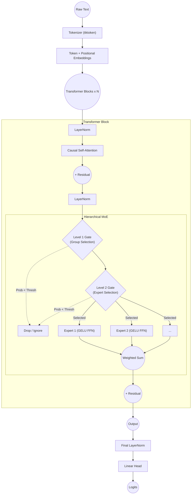

# Base Mixture-of-Experts (MoE) Model

This directory contains the core implementation of the **Dynamic Hierarchical Mixture-of-Experts (MoE)** architecture. It demonstrates a sophisticated alternative to standard dense feed-forward networks (FFNs) by routing tokens dynamically to specific sub-networks (experts) based on learned gating mechanisms.

## Model Architecture Overview

The system is encapsulated within a complete Language Model framework consisting of Tokenization, Embeddings, standard Transformer Attention, and the custom Hierarchical MoE layer.

### 1. Preprocessing & Input Representation
The text input is processed and projected into dense vector space:
- **Tokenizer:** Standard `tiktoken` (GPT-2 BPE encoding) maps text to discrete integers (`vocab_size = 50257`).
- **Input Embeddings:** 
  - **Token Embedding:** `nn.Embedding(vocab_size, d_model)` converts tokens into dense vectors.
  - **Positional Embedding:** `nn.Embedding(max_seq_len, d_model)` provides sequence order context.
- The two embeddings are summed and passed through a dropout layer.

### 2. Transformer Block
The model utilizes a stack of $N$ Transformer blocks. Inside each block:
- **Layer Normalization 1**
- **Causal Multi-Head Self-Attention:** Computes token similarity iteratively using a causal mask to prevent forward-looking.
- **Residual Connection + Dropout**
- **Layer Normalization 2**
- **Hierarchical MoE Layer (Replaces standard FFN)** 
- **Residual Connection + Dropout**

### 3. Hierarchical MoE Layer (Deep Dive)
Instead of feeding every token through a massive dense matrix, the MoE layer selectively routes tokens using a **2-Level Dynamic Router**:

- **Level 1 (Group Routing):** 
  - Token vectors pass through a linear gate outputting `num_groups` logits.
  - A threshold is applied: The token is only routed to a group if its probability $P(group) \ge \frac{1}{\text{num\_groups}}$.
  
- **Level 2 (Expert Routing):**
  - Within an active group, an expert gate calculates probabilities across `experts_per_group` logits.
  - A threshold is applied: The token is only routed to an expert if its specific probability $P(expert|group) \ge \frac{1}{\text{experts\_per\_group}}$.

- **Top-K Fallback:** To ensure stability (preventing tokens from being completely dropped), a global fallback mandates that every token is processed by at least the `top_k` highest-probability experts overall.

- **Sparse Execution:** The routing weights are multiplied by the output of the standard `GELU` activated Feed-Forward Expert layers. Because the process avoids calculating unselected branches, it preserves intense parameter counts while drastically reducing dynamic compute consumption!

### 4. Output Head
- **Final Layer Normalization**
- **Linear Decoder Head:** Projects the dense representations back into `vocab_size` dimensional logits to calculate cross-entropy loss against the next target token.

---

## File Structure
- `hierarchical_moe.py`: Contains the `HierarchicalRouter`, individual `Expert` feed-forward components, the aggregated `HierarchicalMoE` controller, and the fully wrappable `TransformerBlock` and `SimpleTransformerLM`.
- `demo.py`: Proof-of-concept inference script showing how to instantly instantiate and forward test random tensors through the router.
- `test_moe.py`: Essential test suites asserting that dimensions line up perfectly and routing thresholds trigger appropriately.
