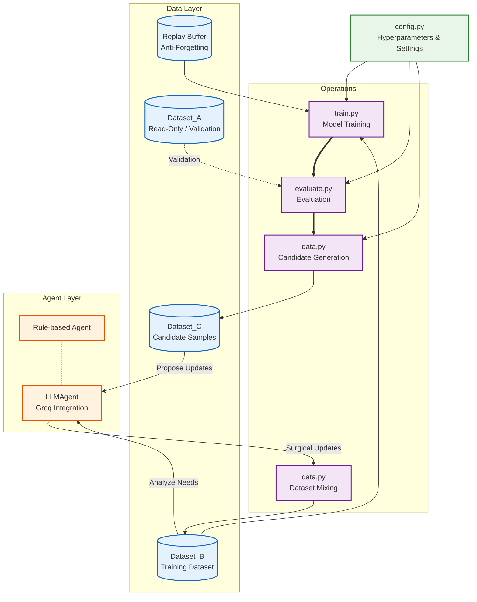
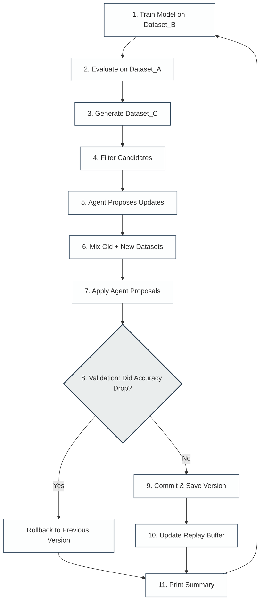

# Operation Evolve: Self-Evolving AI Training System

**Operation Evolve** is a production-grade, self-evolving AI training pipeline in PyTorch. The system orchestrates an iterative cycle where an AI model directly improves its own training dataset. Utilizing sophisticated safety barriers, confidence filtering, and either rule-based heuristics or a Large Language Model (LLM) agent (powered by Groq), the pipeline generates synthetic candidate samples, selectively accepts high-quality ones, rejects noisy data, and merges them to expand the core training dataset safely.

---

## 🏗️ System Architecture

The overarching design ensures strict separation of concerns, modularity, and data safety.



---

## 🔄 The 11-Step Evolution Loop

At the core of Operation Evolve is an iterative self-improvement cycle:



### Explanation of Steps:
1. **Train**: Train the current model (`SimpleNN` or `SimpleTransformer`) on `Dataset_B` plus samples from the Replay Buffer.
2. **Evaluate**: Score the model strictly against a pristine, untouchable validation set (`Dataset_A`).
3. **Generate**: Use the updated model to predict labels for features in `Dataset_B` to create `Dataset_C`.
4. **Filter**: Reject new candidate samples with low confidence scores or near-duplicates (L2 distance check).
5. **Agent Proposals**: Ask either the **Rule-Based Agent** or the **LLMAgent** to dynamically adapt confidence thresholds, filter noisy samples, and decide which class samples to purge.
6. **Mixing**: Use an anti-drift ratio (e.g., `0.7 * old_B + 0.3 * filtered_C`) to ensure the dataset doesn't rapidly degrade.
7. **Apply Updates**: Surgeon-like additions and removals are formally applied to the active dataset instance.
8. **Validation**: The new accuracy is checked against historical records.
9. **Commit/Rollback**: If accuracy worsens significantly (`rollback_tolerance`), the system abandons the modifications and reverts to the last known strong dataset variant & model weights.
10. **Replay Buffer**: Safely persist the most high-confidence new findings to fight catastrophic forgetting.
11. **Summary Logs**: Track Dataset B sizes, versions, acceptance margins, and trajectory insights.

---

## 📂 Safety Measures & Roles

| Concept | Explanation |
|---|---|
| **Dataset_A** | Strictly read-only validation ground truth. Contains zero contamination from training runs. |
| **Dataset_B** | Primary evolutionary asset. Controlled and updated surgically by the Agent. Iterating versions. |
| **Dataset_C** | Fleeting and transient generated candidates (e.g., from generated loops). |
| **Version History** | Explicit saving of `.pt` files and checkpoints at `data/`. If an iteration causes regression, the ecosystem travels back in time. |
| **Propose/Apply** | The Agent **strictly proposes**. Updating datasets only occurs legally through explicit functional pipes. |

---

## 🚀 Getting Started

### Prerequisites
- Python 3.10+
- `torch`
- `groq` (If utilizing the LLMAgent)

Run dependencies installation:
```bash
pip install torch groq pydantic
```

### Running the System
To execute the pipeline, simply run the orchestrator module:

```bash
python main.py
```

### Configuration Configuration
The loop dynamics and hyperparameters are extremely customizable via `config.py`. To toggle advanced capabilities:

```python
cfg = EvolveConfig(
    model_type="SimpleTransformer",     # Architectures: SimpleNN, SimpleTransformer
    num_evolution_loops=10,             # Number of times the dataset will organically grow
    confidence_threshold=0.85,
    rollback_tolerance=0.5,             # 0.5% permitted drop in accuracy before rollback 
    
    # ----------------------------- #
    # Dynamic Groq Agent Toggle     #
    # ----------------------------- #
    use_llm_agent=True, 
    groq_api_key="your_api_key_here",
    llm_model_name="llama-3.3-70b-versatile"
)
```

## 🧠 LLMAgent
By enabling the `LLMAgent`, you inject human-like analytical capabilities into the evolutionary loop. Groq's high-speed inference queries `llama-3.3-70b-versatile` (or your chosen model) per-iteration. The LLM monitors per-class inaccuracies and proposes aggressive targeted purging strategies or relaxed thresholds for struggling cohorts, vastly improving iteration stabilization beyond hard-coded thresholds.
