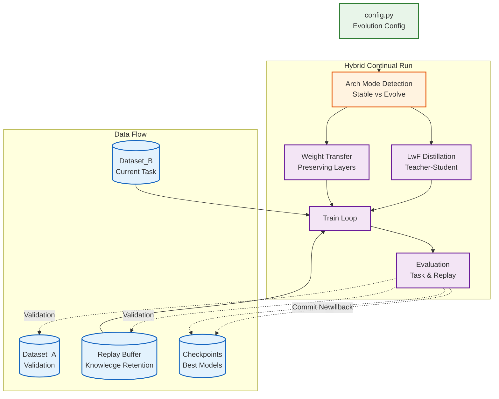
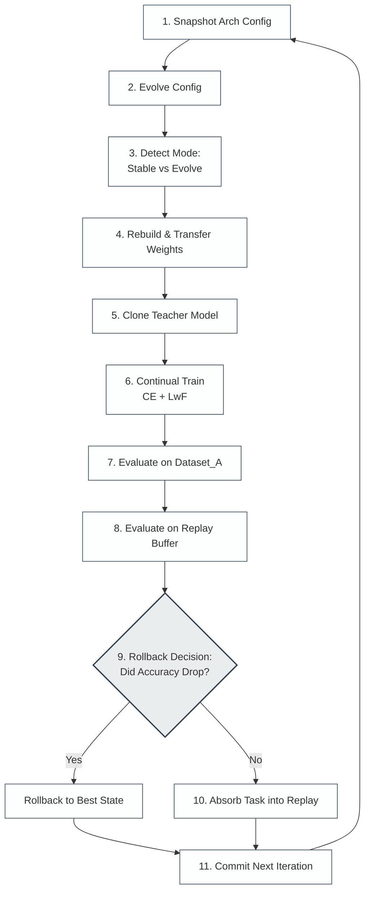

# Operation Evolve: Self-Evolving AI Training System

**Operation Evolve** is a production-grade, self-evolving AI training pipeline in PyTorch. The system orchestrates an iterative cycle where an AI model directly improves its own training dataset. Utilizing sophisticated safety barriers, confidence filtering, and either rule-based heuristics or a Large Language Model (LLM) agent (powered by Groq), the pipeline generates synthetic candidate samples, selectively accepts high-quality ones, rejects noisy data, and merges them to expand the core training dataset safely.

---

## 🏗️ System Architecture

The overarching design ensures strict separation of concerns, modularity, and data safety.



---

## 🔄 The 11-Step Evolution Loop

At the core of Operation Evolve is an iterative self-improvement cycle:



### Explanation of Steps:
1. **Snapshot**: Saves the old architecture configuration to detect changes later.
2. **Evolve**: The LLM Agent modifies structural hyper-parameters (e.g. `hidden_dim`, `num_heads`) for exploration.
3. **Detect Mode**: Checks if the architecture mutated. If unchanged, the system is in `Stable` mode (enabling LwF). Wait, if changed, it's `Evolve` mode.
4. **Rebuild**: If evolved, PyTorch rebuilds the model and surgically transfers compatible legacy weights forward.
5. **Clone Teacher**: If stable, duplicates the pre-trained weights to act as a Teacher for LwF probability distillation.
6. **Continual Train**: Learns the new `Dataset_B` task while mixing historical vectors from the Replay Buffer.
7. **Evaluate (Task)**: Measures accuracy rigidly against ground truth `Dataset_A`.
8. **Evaluate (Replay)**: Measures retention against the `ReplayBuffer` to monitor catastrophic forgetting.
9. **Rollback**: If validation accuracy drops OR if the replay buffer accuracy plummets beyond the `10%` divergence threshold, it rejects the epoch!
10. **Absorb**: High-confidence vectors from current `Dataset_B` are permanently stored via Reservoir Sampling.
11. **Commit**: Save state, ready for `loop_idx + 1`.

---

## 📂 Safety Measures & Roles

| Concept | Explanation |
|---|---|
| **Dataset_A** | Strictly read-only validation ground truth. Contains zero contamination from training runs. |
| **Dataset_B** | Primary evolutionary asset. Controlled and updated surgically by the Agent. Iterating versions. |
| **Dataset_C** | Fleeting and transient generated candidates (e.g., from generated loops). |
| **Version History** | Explicit saving of `.pt` files and checkpoints at `data/`. If an iteration causes regression, the ecosystem travels back in time. |
| **Propose/Apply** | The Agent **strictly proposes**. Updating datasets only occurs legally through explicit functional pipes. |

---

## 🤖 Supported Architectures

The framework allows you to easily hot-swap the model being evolved at any time via the `config.py`:
- **SimpleNN:** A lightweight, 3-layer Multi-Layer Perceptron optimized for rapid continuous numerical simulations.
- **SimpleTransformer:** A foundational Transformer encoder treating continuous generic vectors as sequential inputs.
- **TransformerLM:** A full-featured Language Model that accepts discrete text tokens. It incorporates standard text preprocessing (via `tiktoken` API), Token Embeddings, and Positional Embeddings to maintain production parity with standard text-based Model evolution tasks.

---

## 🚀 Getting Started

### Prerequisites
- Python 3.10+
- `torch`
- `groq` (If utilizing the LLMAgent)

Run dependencies installation:
```bash
pip install torch groq pydantic
```

### Running the System
To execute the pipeline, simply run the orchestrator module:

```bash
python main.py
```

### Configuration Configuration
The loop dynamics and hyperparameters are extremely customizable via `config.py`. To toggle advanced capabilities:

```python
cfg = EvolveConfig(
    model_type="TransformerLM",         # Architectures: SimpleNN, SimpleTransformer, TransformerLM
    num_evolution_loops=10,             # Number of times the dataset will organically grow
    confidence_threshold=0.85,
    rollback_tolerance=0.5,             # 0.5% permitted drop in accuracy before rollback 
    
    # ----------------------------- #
    # Dynamic Groq Agent Toggle     #
    # ----------------------------- #
    use_llm_agent=True, 
    groq_api_key="your_api_key_here",
    llm_model_name="llama-3.3-70b-versatile"
)
```

## 🧠 LLMAgent
By enabling the `LLMAgent`, you inject human-like analytical capabilities into the evolutionary loop. Groq's high-speed inference queries `llama-3.3-70b-versatile` (or your chosen model) per-iteration. The LLM monitors per-class inaccuracies and proposes aggressive targeted purging strategies or relaxed thresholds for struggling cohorts, vastly improving iteration stabilization beyond hard-coded thresholds.
