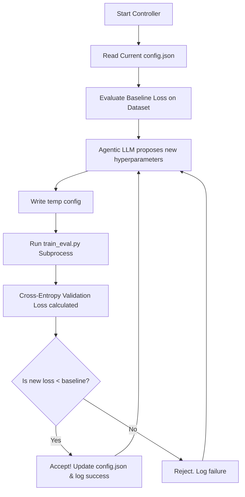
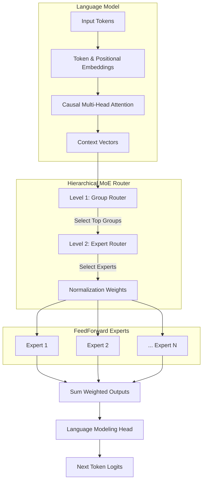

# Operation Evolve: Agentic Mixture-of-Experts (MoE) 🚀

This repository hosts an **Agentic Self-Optimizing Mixture-of-Experts (MoE) Architecture**. Instead of manually tuning hyperparameters, an AI agent continuously proposes, trains, measures, and evolves the MoE structure across epochs to achieve better validation loss on real-world NLP reasoning workloads.

## 🔄 Operation Evolve Cycle



## 🧠 Hierarchical MoE Transformer Architecture



## 🌟 Key Features

1. **Agentic Evolution Controller** (`controller.py`)
   - Uses an external LLM (e.g., Groq's `llama-3.3-70b-versatile` or local Ollama networks) as an intelligent hyperparameter search engine.
   - Proposes structural changes to `config.json` (such as `num_groups`, `experts_per_group`, `d_model`, `d_ff`, and `learning_rate`) based on historical loss logs.
   - Automatically accepts or rejects proposals if the resulting cross-entropy test loss outperforms the historical baseline.

2. **True Causal Language Modeling** (`train_eval.py` & `hierarchical_moe.py`)
   - Implements a modern Decoder-only Transformer framework complete with Tokenization (GPT-2 BPE) and Standard/Rotary Positional Embeddings.
   - Multi-Head Causal Attention acts as the context window before discrete tokens pass into the sophisticated 2-Level Hierarchical Routing MoE framework.
   - `HierarchicalRouter`: Implements dense top-K routing to sub-partition parameters dynamically, saving immense compute per token.

3. **Multi-Task Benchmarking** (`train_eval.py`)
   - Trains and evaluates next-token predictions via Cross-Entropy Loss on dynamic subsets of real-world text logic:
     - 🧮 **GSM8K**: Grade School Math Word Problems.
     - 🏫 **MMLU**: Massive Multitask Language Understanding (Multiple Choice QA).
     - 🧠 **ARC-Challenge**: AI2 Reasoning Challenge.

---

## ⚙️ Installation

1. Install Python dependencies:
```bash
pip install torch transformers datasets requests python-dotenv
```

2. Create a `.env` file in the root directory to provide API keys required by `controller.py`:
```env
GROQ_API_KEY=gsk_your_api_key_here
```

---

## 🚀 Running the Evolution Loop

Kickstart the autonomous evolution cycle by running the controller loop:
```bash
python controller.py
```

### What happens?
1. **BASELINE**: The script evaluates the current parameters stored in `config.json` to establish the baseline `Validation Loss`.
2. **PROPOSAL**: The AI generates a hypothesis (modifying model dimensions or learning rate).
3. **TRAIN & EVALUATE**: `train_eval.py` is spun up in a subprocess utilizing HuggingFace Tokenizers and actual NLP sequences.
4. **DECISION**: The validation loss (Cross-Entropy next token predictability) is parsed. If lower than the baseline, the AI adopts the new parameters and logs it to `evolution_history.log`.
5. **LOOP**: The AI uses the log as context for its next hypothesis, slowly descending into the optimal configurations!
