# Operation Combine: The Infinite AI Orchestrator

**Operation Combine** is the ultimate unified pipeline for self-evolving AI. It merges **Agentic Architecture Evolution** with **Pipelined Continual Learning** into an infinite, zero-downtime loop.

The system cycles through 3 dataset slots continuously. Before every training phase, a Groq-powered LLM agent analyzes historical metrics and proposes structural modifications (expanding layers, adding experts) to the PyTorch model. The model then learns the new data using **Learning without Forgetting (LwF)** and a **Replay Buffer**, ensuring continuous growth without catastrophic forgetting.

---

## 🏗️ System Architecture & Workflow

The orchestration graph below details the exact pipeline flow, including parallel asynchronous data fetching and the structural feedback loop.

```mermaid
flowchart TD
    %% Global Styles
    classDef dataset fill:#e3f2fd,stroke:#1565c0,stroke-width:2px,color:#0d47a1
    classDef evolve fill:#fff3e0,stroke:#e65100,stroke-width:2px,color:#e65100
    classDef train fill:#e8f5e9,stroke:#2e7d32,stroke-width:2px,color:#1b5e20
    classDef update fill:#f3e5f5,stroke:#6a1b9a,stroke-width:2px,color:#4a148c

    %% --- TOP SEQUENCE ---
    D1("Dataset 1"):::dataset --> ME1
    
    subgraph ME1 ["Model Evolve (Detailed)"]
        direction TB
        S1["1. Call Groq Agent API\n2. Analyze Performance Metrics\n3. Propose New Configuration\n4. Rebuild Pytorch Structure\n5. NO WEIGHT UPDATES HERE"]
    end
    
    ME1:::evolve --> T1("Train<br/>(LwF + Replay)"):::train
    T1 --> D2("Dataset 2"):::dataset

    D2 --> ME2
    
    subgraph ME2 ["Model Evolve (Detailed)"]
        direction TB
        S2["1. Call Groq Agent API\n2. Analyze Performance Metrics\n3. Propose New Configuration\n4. Rebuild Pytorch Structure\n5. NO WEIGHT UPDATES HERE"]
    end
    
    ME2:::evolve --> T2("Train<br/>(LwF + Replay)"):::train

    %% --- FIRST SPLIT ---
    T2 --- BAR1( )
    BAR1 --- D3("Dataset 3"):::dataset

    D3 --> ME3("Evolve Model<br/>(JSON Proposal)"):::evolve
    ME3 --> T3("Train<br/>(LwF + Replay)"):::train

    %% --- SECOND SPLIT ---
    T3 --- BAR2( )
    BAR2 --- D1_new("Dataset 1 (Refreshed)"):::dataset

    D1_new --> ME4("Evolve Model<br/>(JSON Proposal)"):::evolve
    ME4 --> T4("Train<br/>(Final Convergence)"):::train

    %% --- ASYNC OVERWRITES (RIGHT SIDE) ---
    T2 --> UD1("Update Dataset 1<br/>(Async Target)"):::update
    T3 --> UD2("Update Dataset 2<br/>(Async Target)"):::update
    T4 --> UD3("Update Dataset 3<br/>(Async Target)"):::update

    %% --- THE CLIMBING FEEDBACK LOOP ---
    UD3 --> D2_loop("Dataset 2 Slot"):::dataset
    D2_loop --> ME_left("Evolve Model"):::evolve
    ME_left --> T_left("Train (Side Loop)"):::train

    T_left --> LOOP_CONNECT(( ))

    %% Connect back up to main flow
    LOOP_CONNECT --> D3
```
    


---

## 🧠 Core Mechanics

### 1. Model Evolve (The Brain)
*   **Action:** Triggers the Groq API (`llama-3.3-70b-versatile`).
*   **Input:** Current configuration and recent metrics log.
*   **Output:** A new JSON proposal (e.g., `expert_hidden_dim: 256`, `num_layers: 4`).
*   **Rule:** **No weights are updated here.** This is purely structural. It builds a fresh PyTorch frame.

### 2. Train (The Muscle)
*   **Action:** 5 Epochs of optimization via PyTorch.
*   **Dataset Mixing:** Dynamically samples from the `ReplayBufferV2` (historic data) and mixes it with the current dataset to prevent Catastrophic Forgetting.
*   **LwF (Learning without Forgetting):** Applies teacher-student distillation when the architecture remains unmutated, forcing the network to match old probability distributions.
*   **Safety Net:** Only after training completes is the model evaluated. If accuracy crashes, a `Rollback` occurs.

### 3. Update Dataset (The Infinite Engine)
*   **Action:** Asynchronous PyTorch thread execution.
*   **Logic:** While the GPU is locked running the intense `Train` step, a background thread silently hits the internet via `groq_fetcher.py`, tokenizes new text, and overwrites the next `dataset_{id}.pt` file on disk. 

---

## 🚀 Getting Started

### Prerequisites
- Python 3.10+
- `torch`
- `requests`
- `python-dotenv`

### Execution

Ensure you have a `.env` file containing your API Key inside the directory:

```bash
GROQ_API_KEY="your-api-key-here"
```

To ignite the infinite loop, run:

```bash
python combined_orchestrator.py
```

### Configuration
Tune hyperparameters in `config.py`. The standard model is `HierarchicalMoE`, but it supports `SimpleTransformer` or `SimpleNN` for testing.
