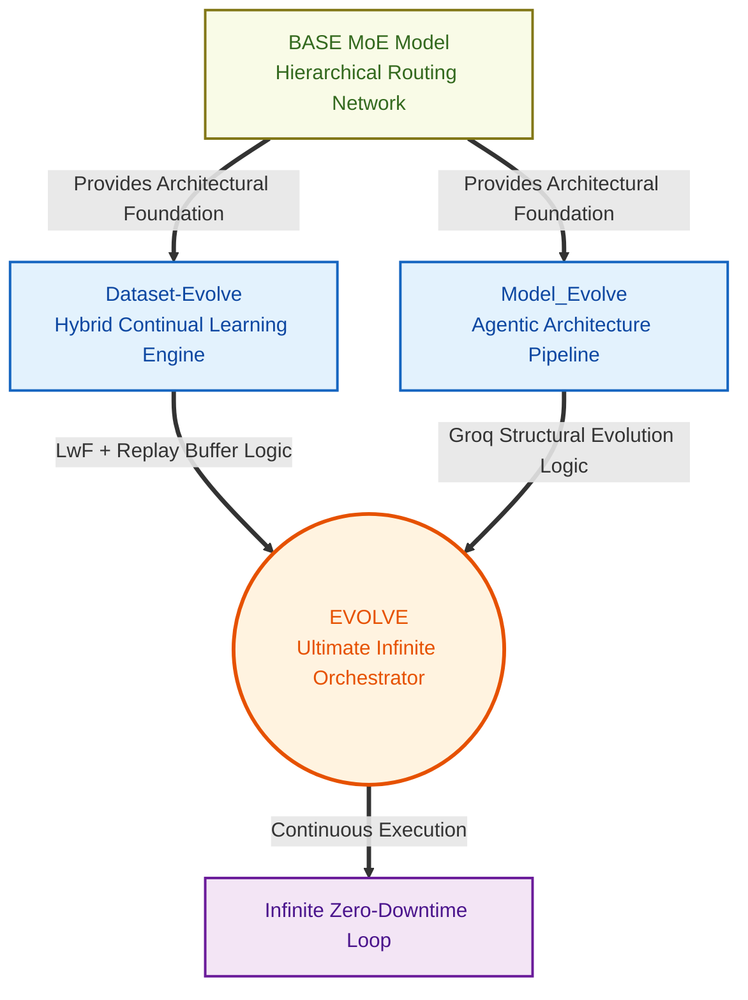

# Operation Evolve: Autonomous AI Ecosystem

**Operation Evolve** is a state-of-the-art framework designed to create a completely autonomous machine learning environment. Instead of relying on static, human-curated datasets and fixed model architectures, Operation Evolve features an AI that simultaneously manages the targeted improvement of its own dataset while evolving its highly-sparse Mixture-of-Experts (MoE) capacity sequentially to conquer new distributions.

## 🚀 Ecosystem Architecture

The repository is modularly broken down into three specialized subsystems. They all share common preprocessing constraints—such as `tiktoken` BPE encodings, token embeddings, and structural parity—ensuring seamless interchangeability.


### 1. `Dataset-Evolve/`
The autonomous **Data Generation & Hybrid Continual Learning Engine**.
- Uses an 11-Step loop to safely introduce generated candidate samples.
- Features a powerful **Groq LLM Agent** integration. The Agent acts as an analyst looking at class-level failure rates and strategically proposes surgical dataset purges, confidence threshold adjustments, and targeted data mining loops.
- Employs a Replay Buffer system utilizing L2-distance filtering to introduce synthetic data while rigorously preventing catastrophic forgetting and model drift.
- Supports Continuous Vectors (`SimpleNN`, `SimpleTransformer`) and Discrete Token sequences (`TransformerLM`).
- Implements **Learning without Forgetting (LwF)** and a **Replay Buffer Reservoir** to ingest sequential tasks without catastrophic forgetting.
- Features a powerful Groq LLM Agent integration to strategically propose targeted data mining, class purges, and structural mutations.

### 2. `Model_Evolve/`
The **Continuous Learning Pipeline**.
- Manages the progressive exposure of the AI model sequentially across massive sets of localized domain spaces (e.g., `Dataset 1 -> Dataset 2 -> Dataset 3`).
- Orchestrates multi-threaded loops (Pipelined Continual Learning) utilizing the Groq API to scrape, fetch, and organize real-world data asynchronously while the GPU simultaneously executes backward passes.
- Uses strict Evaluation Validation points to trigger checkpoints or immediate state rollbacks when the loss begins to decay.

### 3. `BASE MoE Model/`
The **Core Neural Architecture**.
- Implements the **Dynamic Hierarchical Mixture-of-Experts**.
- Replaces monstrously expensive dense feed-forward networks with a 2-Level Dynamic Router. Tokens must pass strict algorithmic probability thresholds (Group Gate + Specific Expert Gate) to activate specialized sub-networks.
- Features built-in global Top-K safety fallbacks.
- Contains the `TransformerLM` wrapping modules demonstrating how standard Causal Multi-Head Attention, Layer Normalizations, Positional indexings, and tokenizer integrations surround the highly efficient sparse layer.

### 4. `EVOLVE/`
The **Ultimate Infinite AI Orchestrator**.
- The pinnacle system that merges the capabilities of the primary pipes into a unified core.
- Implements an infinite, zero-downtime cyclic loop utilizing multi-threading. While the GPU trains on Data Slot $N$ via LwF and Replay Buffers, a background thread asynchronously hits the Groq API to scrape internet data for Data Slot $N+1$.
- Performs continuous structural evolution natively with dynamic weight transfers and safe rollback logic.

---

## 🏎️ Quick Start

To dive into the self-evolving operations, navigate to the respective modules and check out their localized `README.md` documents. 

```bash
# Clone the complete ecosystem
git clone https://github.com/MaheshChalla2701/Operation-Evolve.git

# Install required standard dependencies
pip install torch groq tiktoken pydantic requests python-dotenv

# 1. To explore the Hybrid Continual Learning Engine
cd Dataset-Evolve
python main.py

# 2. To unleash the Infinite Combined Orchestrator
cd ../EVOLVE
python evolve.py
```

## ⚙️ Shared Philosophy
Across `Model_Evolve`, `Dataset-Evolve`, and the `Base MoE`, all architectures now adhere to the foundational `TransformerLM` standard. Text inputs are strictly routed through the GPT-2 specific byte-pair-encodings, projected with standard `nn.Embedding` lookup tables, and contextually indexed with absolute sinusoidal or sequential representations before interacting with the self-attention mechanisms.
