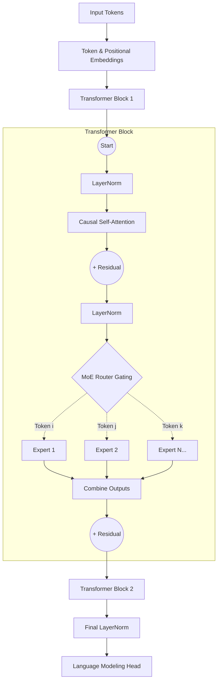

# Operation Evolve 🧬

**AI systems that combine transformers, agentic AI, and feedback loops to build adaptive systems that evolve their behavior and performance over time.**


A **Self-Improving AI System** built with PyTorch. A Sparse Mixture of Experts (MoE) Transformer autonomously evolves its own architecture using an LLM-Agent (Groq/Llama 3) based on its own training performance metrics.

## How It Works

```text
┌─────────────┐      ┌──────────────┐     ┌─────────────────┐      ┌──────────────┐
│   TRAIN     │────▶│   METRICS    │────▶│   AI AGENT      │────▶│   TEST NEW   │
│  (150 iters)│      │  metrics.json│     │  (Llama 3)      │      │  (50 iters)  │
└─────────────┘      └──────────────┘     └─────────────────┘      └──────────────┘
       ▲                                          │                       │
       │                 Accept if improved ◀────┘─────── Reject ─────── ┘
       │                 config.json updated                  (revert)
       └──────────────────────────────────────────────────────────────────
```

## Model Architecture

**SparseMoETransformer** — Character-level next-token prediction:
- 2 × Self-Attention Layers (Causal)
- 1 × Sparse MoE Layer per block (Top-1 Gating — only 1 expert active per token)
- Dynamically configured → number of experts, hidden dim, temperature all evolve




## AI Evolution Agent (Groq / Llama-3.3-70B)

Unlike traditional hyperparameter search algorithms, **Operation Evolve** uses a true LLM reasoning Agent (`agent.py`). 

1. `controller.py` trains the baseline model for a full cycle and evaluates Loss, Accuracy, and the Token-Load percentage distributed across every MoE Expert.
2. The metrics and current architecture are packaged into a JSON prompt and sent to the **Groq API** (`llama-3.3-70b-versatile`).
3. Llama 3 autonomously "researches" the model's bottleneck. For example, if one Expert handles 45% of tokens, it may artificially lower the `router_temperature`. If capacity is tapped, it may append a brand new Expert to the neural network.
4. Llama 3 returns a strict JSON payload containing the upgraded `config.json`.
5. The Controller triggers **Speculative Acceptance**: it tests the AI's proposal. If Val Loss drops, the change becomes the new baseline. If the model crashes or degrades, the Controller safely rolls back the PyTorch weights to the previous checkpoint.

## Setup

### Local Setup
1. Install requirements:
```bash
pip install torch requests tiktoken python-dotenv
```

2. Add your Groq API Key to a `.env` file (see `.env.example`).

3. Launch the Autonomy Loop:
```bash
python controller.py
```

### Run on Google Colab (Recommended for GPU)
The easiest way to run the self-improvement loop with a free GPU:

1. Open a New Notebook in [Google Colab](https://colab.research.google.com/).
2. Enable the **T4 GPU** (`Runtime` > `Change runtime type` > `T4 GPU`).
3. Paste and run this single block of code:
```python
# Clone the repository directly from GitHub
!git clone https://github.com/MaheshChalla2701/Operation-Evolve.git
%cd Operation-Evolve

# Install required dependencies
!pip install tiktoken python-dotenv requests

# Set your Groq API Key
import os
os.environ["GROQ_API_KEY"] = "gsk_your_api_key_here"

# Start the self-improvement loop
!python controller.py
```

## Included Core Files

| File | Purpose |
|---|---|
| `config.json` | Current model hyperparameters and structure config |
| `model.py` | SparseMoETransformer PyTorch implementation |
| `trainer.py` | Evaluation module |
| `agent.py` | LLM API Engine — queries Groq to mutate the JSON architecture |
| `controller.py` | **Main autonomy loop** |